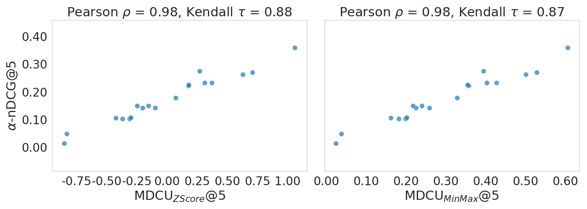
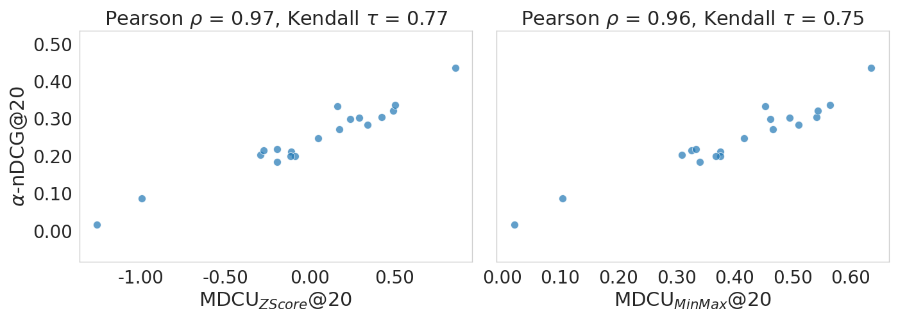

# SIGIR-SP-MDCUEval
Repository for the SIGIR Short Paper (SP) "Evaluating MDCU in Information Retrieval"


## Overview
This repository contains the code and a demo script for reproducing the results of the paper "A Blueprint of IR Evaluation Integrating Task and User Characteristics" by Jarvelin and Sormunen available at [ACM Digital Library](https://dl.acm.org/doi/10.1145/3675162).

## Requirements
The `config` folder constains the required configuration files for the demo script. It provides the following files:
- `bases.ini`: contains the overlapping bases for the evaluation
- `environment.yml`: contains the conda environment for the demo script

## Installation
To install the required conda environment, run the following command:
```bash
conda env create -f config/environment.yml
```

## Source code
The source code is available in the `src` folder. 

## Running the demo script
To run the demo script, execute the following command:
```bash
python demo.py
```

## Results
The results of the demo script are stored in the `results` folder.





